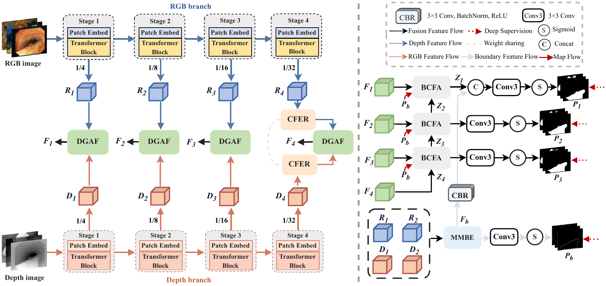
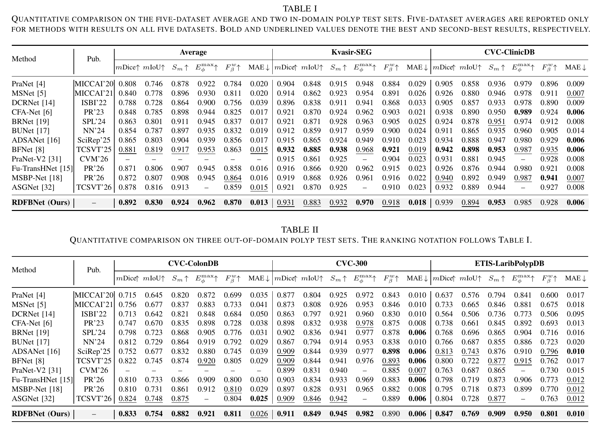
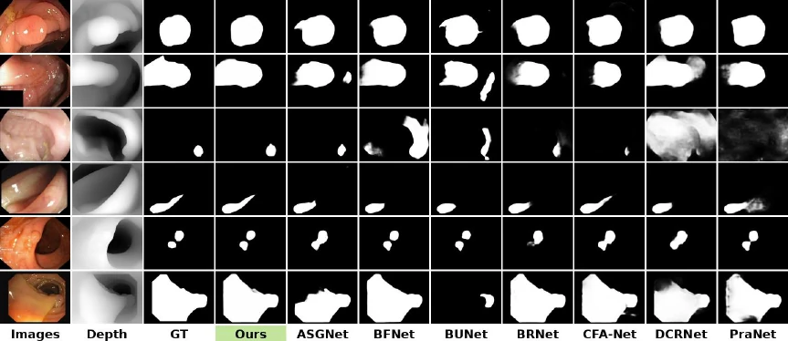
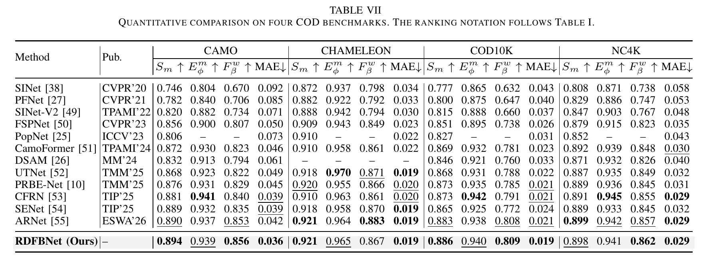
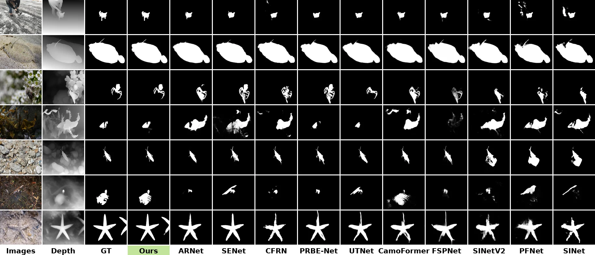

# RDFBNet

Official repository for **Pseudo-Depth-Assisted Polyp Segmentation via Discrepancy-Guided Fusion and Boundary-Guided Decoding**.

RDFBNet is a pseudo-depth-assisted segmentation framework built around discrepancy-guided RGB-D fusion and boundary-guided decoding. In addition to polyp segmentation, we evaluate its cross-task applicability on camouflaged object detection (COD).

> The paper is currently under review. Code and pretrained models will be released after acceptance.

## Architecture

  

## Polyp Segmentation

### Quantitative Results

  

### Qualitative Results

  

## Camouflaged Object Detection

### Quantitative Results

  

### Qualitative Results

  

## Citation

Citation information will be added when the paper's official bibliographic record becomes available.

## Contact

For questions, please contact the authors.
